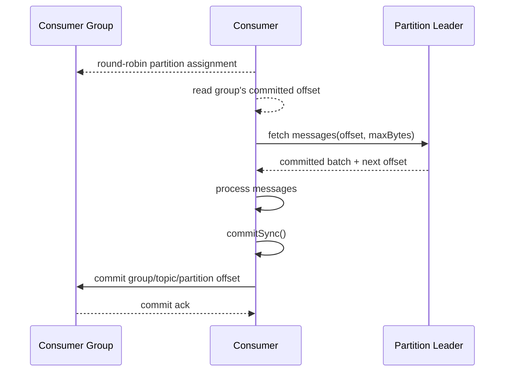
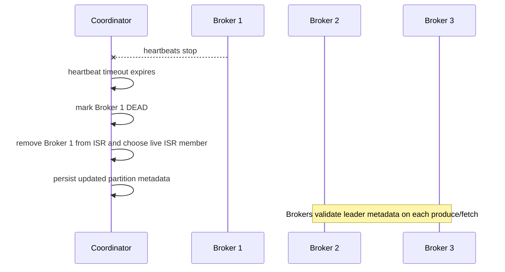
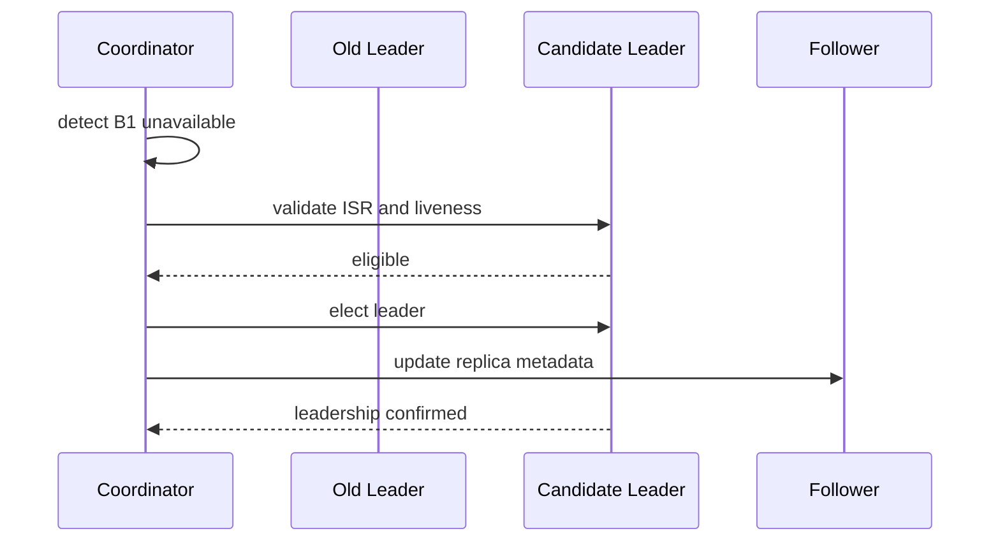
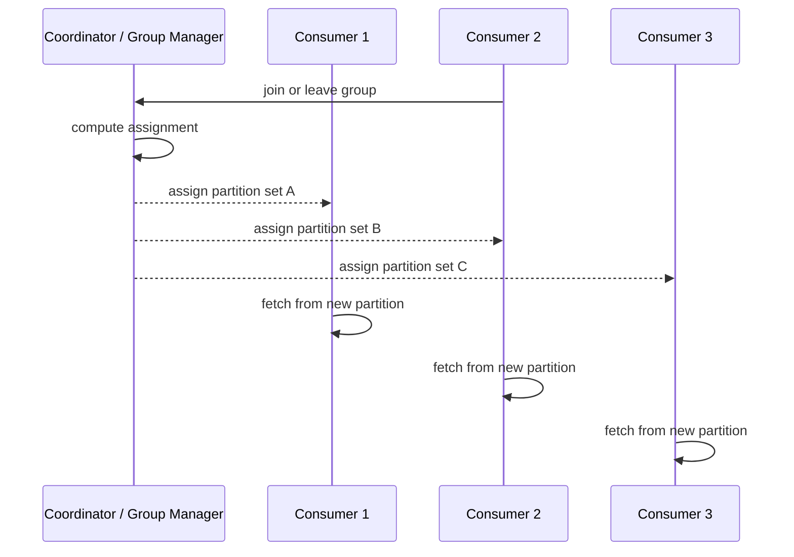

# Sequence Diagrams

These diagrams describe the implemented local flow where available. Guarantees remain subject to the single-coordinator, no-fencing limitations documented in the repository README.

## Producing a message

```mermaid
sequenceDiagram
    participant P as Producer
    participant C as Coordinator
    participant B as Broker Leader
    participant F as Broker Follower

    P->>C: get topic + partition metadata
    C-->>P: partition count, leader, replicas, ISR
    P->>B: append batch (topic, partition, messages)
    B->>B: append to local log and force
    alt ACK_ALL
        B->>F: replicate missing records to ISR
        F-->>B: append and report log end
        B->>C: update replica progress / high-watermark
    else ACK_1
        Note over B,F: Followers may lag; consumers stop at high-watermark
    end
    B-->>P: produce result
```

## Consuming a message



## Broker failure



## Leader election



## Consumer rebalance


